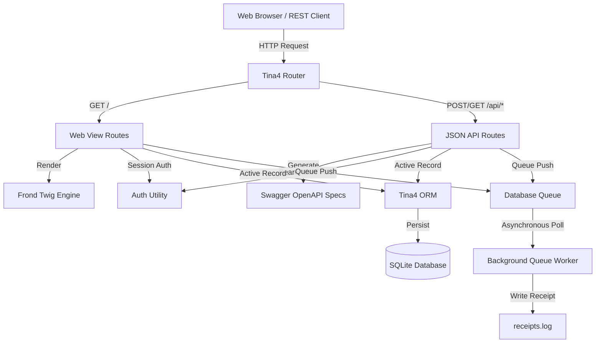

# Building Lend: A Modern Lending-Library with Tina4 Python

This blog post reviews the architecture, features, and key engineering decisions made while building **Lend**, a community library application using the **Tina4 Python** framework.

---

## What is Lend?

**Lend** is a production-ready community lending-library application that provides:
1. **A public portal**: Visitors can browse and search the library catalogue by title, author, or published year, and page through results smoothly.
2. **A staff portal**: Logged-in staff members can manage the library, including adding/editing/deleting books (with cover image upload) and members, and recording loans/returns.
3. **Double-booking prevention**: The system enforces that a book cannot be borrowed by multiple members at once.
4. **Immediate return on loans**: Recording a loan triggers a background queue that processes email receipts asynchronously, preventing the API from blocking.
5. **Full audit trail**: Every change is tracked, recorded, and attributed to the logged-in staff member.
6. **Multi-lingual interface**: Seamless English and Spanish translation support.

---

## Architectural Deep-Dive

Lend leverages the built-in capabilities of **Tina4 Python**, which prioritizes convention over configuration and zero third-party runtime dependencies.



### 1. Data Layer & Persistence
We selected **SQLite** as the database engine for portability, zero-config overhead, and full compliance with the requirement of keeping all project files inside the working directory.
- Database schemas and relationships are set up via a sequence migration (`migrations/000001_init_lend.sql`).
- To handle large catalogues (tens of thousands of titles) efficiently, we created explicit indices on searchable columns: `books(title)`, `books(author)`, `books(published_year)`, and relationship lookups `loans(book_id)`, `loans(returned_date)`.
- Models inherit from the `ORM` base class and declare relationship mappings utilizing `ForeignKeyField(to=...)`.

### 2. Dual-Layer Authentication
We implemented a secure, flexible authentication gate that protects both:
- **Web UI**: Session cookies store the authenticated user token.
- **REST API**: Standard `Authorization: Bearer <JWT>` header verification.

Tina4's built-in `Auth` module uses standard libraries only (`hmac`, `hashlib`, `pbkDF2`) to securely hash passwords (`pbkdf2_sha256$260000$salt$hash`) and sign JWT payloads. Security checks are evaluated transparently at the route level via `@secured()` and `@noauth()` decorators.

### 3. Asynchronous Queue Receipts
When a staff member registers a loan, the API must return immediately. To achieve this, Lend pushes a payload containing loan details to the `emails` topic queue.
An asynchronous background callback (`poll_email_queue`) runs cooperatively in the asyncio event loop every 1.0s, polling for tasks, appending simulated receipt emails to `receipts.log`, and completing the job. 

### 4. Internationalization (I18n)
Tina4 v3 has native i18n support. We populated `src/locales/en.json` and `src/locales/es.json`.
To guarantee thread-safety during concurrent request processing, we added a custom global `translate(key, lang)` template function that allows Twig files to resolve strings relative to the user's active session language:
```twig
{{ translate("books", lang) }}
```

---

## Key Engineering Decisions

### Decision A: Standardizing Handler Signatures to `(request, response)`
Tina4's development server resolves route parameters dynamically by mapping path variables (e.g. `{id:int}`) to function arguments (e.g. `def my_handler(id, request, response)`). However, the framework's `TestClient` class invokes handlers by passing exactly two arguments: `handler(request, response)`.
To bridge this gap and make the routes fully compatible with both the server run-time and testing:
- We standardized all route signatures to `async def my_handler(request, response):`.
- Inside the functions, we resolved path parameters using the request helper: `id = int(request.param("id"))`.

### Decision B: Monotonic Sorting for Audit Trails
Initial sorting of audit logs was implemented as `ORDER BY created_at DESC`. During high-throughput automated test runs, multiple database transactions occurred within the same second. Because SQLite's default datetime accuracy is second-based, several logs shared identical timestamps, causing the database to return records out of chronological order.
We solved this by sorting on `ORDER BY id DESC`, ensuring absolute sequence integrity regardless of sub-second overlap.

### Decision C: Self-Contained Testing Isolation
To verify Lend's features without polluting the active database (`app.db`), we configured the integration test suite (`test_lend.py`) to override the environment database URL to `sqlite:///test.db`.
Because of SQLite file locks on active connection pools, `os.remove("test.db")` occasionally fails during continuous runs. We added explicit table drops (`DROP TABLE IF EXISTS`) in the `setUpClass` phase to guarantee a clean slate before executing migrations.
